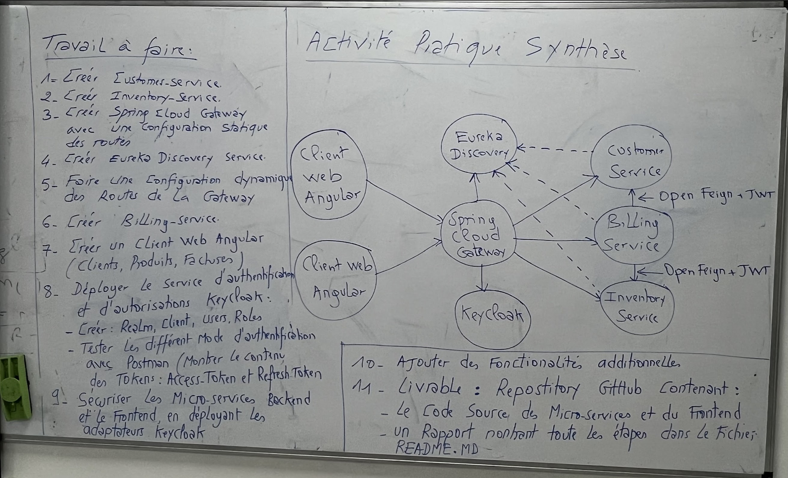

[](#contributors-)

<h1 align="center">
  <a href="https://github.com/ach-code/Digital_Banking_BackEnd_Spring">
    Manage Billing Backend
  </a>
</h1>

<p align="center">
    <a href="#">
        
    </a>
    <a href="#">
        
    </a>
    <a href="#">
        
    </a>
    <a href="#">
        
    </a>
    <a href="#">
        
    </a>
    <a href="#">
        
    </a>
</p>
<br>

## About The Project
Application based on a microservice architecture which makes it possible to manage invoices containing products and belonging to a customer

### Work To Do



### Built With

* [Java](https://www.java.com/en/)
* [Spring](https://spring.io/)
* [Spring Microservices](https://spring.io/microservices)
* [Spring Security](https://spring.io/projects/spring-security)
* [Keycloak](https://www.keycloak.org/)
* [Postgresql](https://www.postgresql.org/)

<p align="right">(<a href="#top">back to top</a>)</p>


<!-- GETTING STARTED -->
## Getting Started

### Prerequisites

You need to install Java JDK and java ide like IntelliJ IDEA or Eclipse ...
* JDK
  ```sh
  https://www.oracle.com/java/technologies/downloads/
  ```

* IntelliJ IDEA
    ```sh
    https://www.jetbrains.com/idea/
    ```
### Installation

1. Clone the repo
   ```sh
   git clone https://github.com/chikeb-aymen/Edu_Stock_App.git
   ```
2. Install JDK
   ```sh
    https://www.jetbrains.com/idea/
   ```
3. Install all pom.xml dependency
   ```sh
   mvn install
   ## for each microservices
   ```

<p align="right">(<a href="#top">back to top</a>)</p>

## APIs 
### For Customer-Service
#### Get All Customers

```
http://localhost:8081/api/v1/customers
```
#### Get Customer By ID

```
http://localhost:8081/api/v1/customers/<id>
```

### For Inventory-Service
#### Get All Products

```
http://localhost:8082/api/v1/products
```
#### Get Customer By ID

```
http://localhost:8082/api/v1/products/<id>
```

### For Billing-Service
#### Get All Bills

```
http://localhost:8083/api/v1/billing
```
#### Get FullBill By ID

```
http://localhost:8083/api/v1/bills/fullBill/<id>
```
### Gateway
#### If you want to call all apis by one and only one port 
```
http://localhost:8080/api/v1/customers

http://localhost:8080/api/v1/customers/<id>

http://localhost:8080/api/v1/products

http://localhost:8080/api/v1/products/<id>

http://localhost:8080/api/v1/billing

http://localhost:8080/api/v1/bills/fullBill/<id>
```